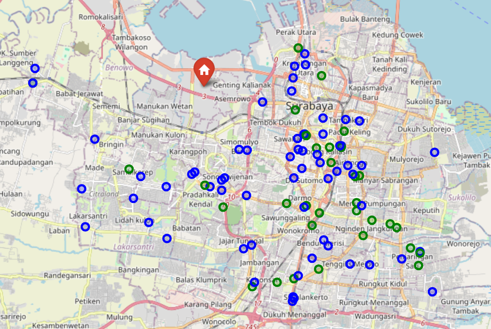

# 🚚 CVRP Optimization — Surabaya Minimarket Distribution

Optimizing delivery routes for 96 Indomaret & Alfamart stores in Surabaya using 
the Capacitated Vehicle Routing Problem (CVRP) approach.

---

## 📌 Problem Statement
Given 96 convenience stores across Surabaya, how do we assign and optimize 
delivery routes for 10 trucks (capacity: 10 stores each) to minimize total 
distance traveled?

---

## 📦 Dataset
- **Source**: OpenStreetMap via Overpass Turbo
- **Coverage**: 96 stores (63 Indomaret, 33 Alfamart) in Surabaya
- **Depot**: Margomulyo Industrial Area

---

## 🗺️ Store Distribution

---

## ⚙️ Approach
| Method | Total Distance |
|---|---|
| Nearest Neighbour (Baseline) | 277.52 km |
| OR-Tools (Optimized) | 238.58 km |

**Result: 14% reduction in total distance (38.94 km saved)**

---

## 🗺️ Route Comparison

**Baseline — Nearest Neighbour**

**Optimized — OR-Tools**

---

## 🛠️ Tools
Python, OR-Tools, Folium, Pandas, OpenStreetMap
